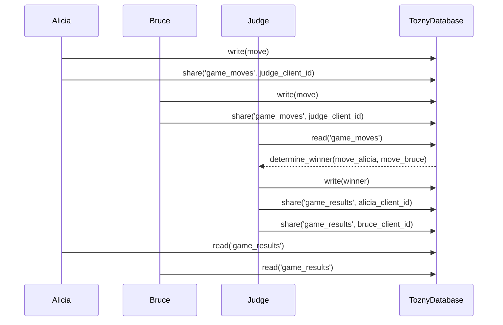

# Title: Rock Paper Scissors Game README

## Overview:
The Rock Paper Scissors game is a well-known simple game played by two players. Each player chooses one out of three possible moves: rock, paper, or scissors. The winner is determined based on a predetermined set of rules: rock beats scissors, paper beats rock, and scissor beats paper. 

This design document outlines a version of the Rock Paper Scissors game that involves three parties: Alicia, Bruce, and Judge Clarence, who decides the winner. This game will be implemented using the Tozny SDK, and the constraints are as follows: 1.) only Judge Clarence can decrypt the game moves sent in by Alicia and Bruce, and 2.) the result of the game can be decrypted by all three parties.

## User Interface:
This version of the Rock Paper Scissors game will be played using a command-line interface (CLI). Players will submit their moves using the following command:

```
$ python3 play.py round=X name=Y move=Z tozny-client-credentials-filepath=./creds.json
```

Where:
* `X` is the round number (an integer)
* `Y` is the player's name (either "Alicia" or "Bruce")
* `Z` is the player's move (either "rock", "paper", or "scissors")
* `tozny-client-credetials-filepath` is the file path to the player's Tozny client credentials

Players will be able to view the result of a round using the following command:

```
$ python3 winner.py round=X tozny-client-credentials-filepath=./creds.json
```

Where:
`X` is the round number (an integer)
`tozny-client-credentials-filepath` is the file path to the player's Tozny client credentials

Judge Clarence will use the following command to judge a round:

```
$ python3 judge.py round=X tozny-client-credentials-filepath=./creds.json
```

Where:
* `X` is the round number (an integer)
* `tozny-client-credentials-filepath` is the file path to Judge Clarence's Tozny client credentials

## Architecture:
The Rock Paper Scissors game will be implemented using the Tozny SDK and will utilize *asymmetric* encryption for the game moves. Alicia and Bruce will use their Tozny clients to encrypt their game moves and share them with Judge Clarence using the `client.share()` function and Judge Clarence's client ID. Judge Clarence can then use his Tozny client to read the encrypted game moves that have been shared with him. Instead of using *symmetric* encryption for the result of the game, Judge Clarence can use his credentials to encrypt the result of the game and use the `client.share()` function to share it with both Alicia and Bruce. This allows us to avoid the complexity of *symmetric* encryption, making the process much easier, which is precisely the value proposition that the Tozny SDK offers. Finally, Alicia and Bruce can then use their respective Tozny clients to read the shared result of the game from the Tozny database.

The following diagram illustrates the overall architecture of the Rock Paper Scissors game:



### Process:
1. Alicia and Bruce use their respective Tozny clients to encrypt their game moves.
2. Alicia and Bruce use the `client.share()` function to share their encrypted game moves with Judge Clarence, using his client ID.
3. Judge Clarence uses his Tozny client to read the encrypted game moves that have been shared with him.
4. Judge Clarence determines the winner of the round and writes the result of the game to the database, encrypted using his credentials.
5. Judge Clarence shares the result of the game with both Alicia and Bruce by using the `client.share()` function with their client IDs.
6. Alicia and Bruce use their Tozny clients to read the shared result of the game from the database.

## Technical Details:

The Rock Paper Scissors game will be implemented using the Python programming language and the Tozny SDK. The game will be implemented as three separate programs: `play.py`, `winner.py`, and `judge.py`.

### Program 1: play.py

This program will be used by the players to submit their game moves. 

#### Inputs 

`play.py` will take the following arguments:

- `round`: the round number (an integer)
- `name`: the player's name (either "Alicia" or "Bruce")
- `move`: the player's move (either "rock", "paper", or "scissors")
- `tozny_client_credentials_filepath`: the file path to the player's Tozny client credentials
- `judge_client_id`: the client ID of Judge Clarence (hardcoded in using a `config.json` file, but also available as an optional argument)

#### Outputs

`play.py` will share the following records with Judge Clarence:

An encrypted version of the player's move, including the player's client ID. The record's metadata will include the record type `rps-move`, and the round number.  

#### Algorithm

1. Load the Tozny client credentials from the file specified by `tozny_client_credentials_filepath`.
2. Initialize the Tozny client with the client credentials.
3. Check to see if a move has already been recorded for the specified round.
3. Encrypt the player's move.
4. Share the encrypted move along with the player's client ID with Judge Clarence using the `client.share()` function and Judge Clarence's client ID.

Note: The client ID of Judge Clarence will be hardcoded in the program, but it will be also available as a modifiable argument for flexibility.

### Program 2: winner.py

This program will be used by the players to view the result of a round. 

#### Inputs

`winner.py` will take the following arguments:

* `round`: the round number (an integer)
* `tozny_client_credentials_filepath`: the file path to the player's Tozny client credentials

#### Outputs

`winner.py` will print the following output to the console:

The winner of the specified round (either the name of the player, or "tie" if it was a draw)

#### Algorithm

1. Load the Tozny client credentials from the file specified by `tozny_client_credentials_filepath`.
2. Initialize the Tozny client with the client credentials.
3. Query for the result of the game that has been shared with the player from the Tozny database using the record type `rps-result` and the round number.
4. Read the encrypted result of the game.
5. Decrypt the result of the game using the player's private key.
6. Print the winner to the console.

### Program 3: judge.py
This program will be used by Judge Clarence to read the moves for a round, determine the winner, and write an encrypted version of the winner that can be read by both players.

#### Inputs
`judge.py` will take the following arguments:

* `round`: the round number (an integer)
* `tozny_client_credentials_filepath`: the file path to the Tozny client credentials file for the Judge

#### Outputs
`judge.py` will write the following record to the Tozny database and share it with both players:

An encrypted version of the winner of the round. The record's metadata will include the record type `rps-result`, and the round number.  

#### Algorithm
1. Load the Tozny client credentials from the file specified by `tozny_client_credentials_filepath`.
2. Initialize the Tozny client with the client credentials.
3. Query the Tozny database for the encrypted moves that have been shared with Judge Clarence using the specified round number and the record type `rps-move`.
4. Decrypt the moves using the Judge's private key.
5. Make sure that there are only two moves from two unique players for the specified round.
6. Determine the winner of the round based on the moves.
7. Encrypt the result of the game using Judge Clarence's credentials.
8. Share the encrypted result of the game with both players using the `client.share()` function and the players' client IDs, which are included in the bundled moves.

#### Example
```
$ python3 judge.py round=1 tozny_client_credentials_filepath=./clarence_creds.json
Round “1” Judged!
```

## Questions to consider
What should happen if a move has already been submitted for the specified round number entered in the CLI command? Should the game moves be overwritten, or should an error message be displayed? (This is now handled by querying the database for an existing move for that round before writing a new move to the database.)

What if a player other than Alice or Bruce submits a move for a round that Alice and Bruce are playing? 
